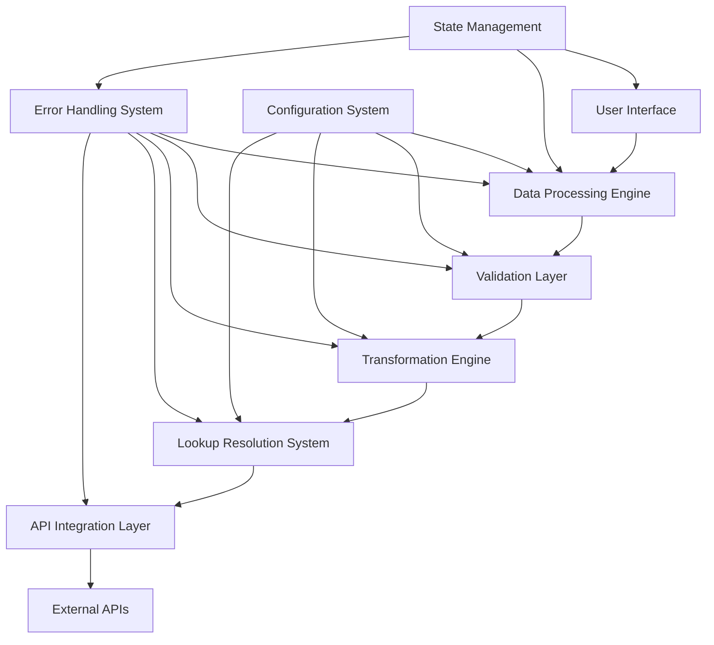
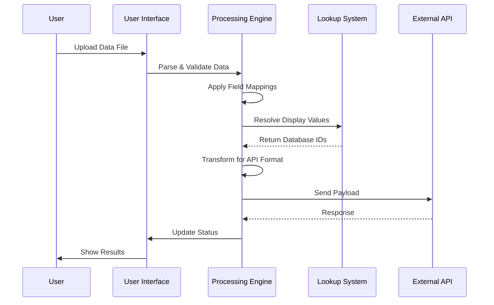

# PortPro Data Bridge AI Documentation

This documentation explains the data mapping and API integration system used in the PortPro Data Bridge AI application.

## 📋 Table of Contents

1. [Overview](#overview)
2. [Documentation Structure](#documentation-structure)
3. [Quick Start](#quick-start)
4. [System Architecture](#system-architecture)
5. [Key Concepts](#key-concepts)
6. [Development Guide](#development-guide)

## Overview

The PortPro Data Bridge AI system processes uploaded data through a sophisticated pipeline that validates, transforms, and maps data to external API endpoints. The system ensures data integrity while handling different entity types with their specific business requirements.

## Documentation Structure

This documentation is organized into several focused documents:

### Core System Documentation

- **[Data Mapping and API Flow](./data-mapping-and-api-flow.md)** - Complete overview of the data processing pipeline
- **[Entity-Specific Transformations](./entity-specific-transformations.md)** - Detailed transformation logic for each entity type
- **[Lookup System Architecture](./lookup-system-architecture.md)** - How display values are converted to database IDs
- **[Error Handling and Recovery](./error-handling-and-recovery.md)** - Comprehensive error handling mechanisms

## Quick Start

### Understanding the Flow

The system follows this high-level process:

1. **Data Upload** - User uploads CSV/Excel files
2. **Preview & Validation** - Data is parsed and validated
3. **Column Mapping** - AI maps columns to entity fields
4. **Field Transformation** - Data is transformed for API compatibility
5. **Lookup Resolution** - Display values converted to database IDs
6. **API Export** - Data sent to external APIs
7. **Error Handling** - Failed records are highlighted and managed

### Key Files to Understand

```
src/
├── hooks/useExport.ts              # Main export orchestration
├── utils/fieldMapper.ts            # Data transformation logic
├── contexts/AppContext.tsx         # Application state management
├── store/slices/exportDataSlice.ts # Redux state for exports
└── components/
    ├── DataTable.tsx              # Data preview and editing
    └── dialogs/ExportDialog.tsx   # Export configuration

exportEntities.json                 # Entity configuration
```

## System Architecture

### High-Level Components



### Data Flow



## Key Concepts

### Entities

An **entity** represents a type of business object (Load, Customer, Driver, etc.) with:
- Specific field mappings
- Validation rules
- Transformation logic
- API endpoint configuration

### Field Mapping

**Field mapping** converts UI column names to API field names:
- Display Name: "Customer Name" → API Field: "caller"
- Includes data type conversion and validation
- Handles complex transformations (arrays, objects, dates)

### Lookup Resolution

**Lookup resolution** converts human-readable values to database IDs:
- "ACME Corporation" → "64f7a1234567890abcdef123"
- Validates against authoritative data sources
- Handles special cases like "All" values

### Upload Types

The system supports different **upload patterns**:
- **Bulk Upload**: Send all rows in single API call
- **Single Row**: Send each row individually
- **Load Special**: Individual rows with special formatting

## Development Guide

### Adding a New Entity

1. **Configure Entity** in `exportEntities.json`:
```json
{
  "id": "NewEntity",
  "name": "New Entity",
  "url": "/api/new-entity",
  "uploadType": "BULK_UPLOAD",
  "fields": [...]
}
```

2. **Add Transformation Logic** in `fieldMapper.ts`:
```typescript
if (entityConfig.name === "NewEntity") {
  // Custom transformation logic
  mappedItem.customField = processCustomField(mappedItem.inputField);
}
```

3. **Add Lookup Sources** if needed:
```typescript
const LookupKeyMapper = {
  'newLookupType': 'internalSourceName'
};
```

### Debugging Data Flow

1. **Enable Debug Logging**:
```typescript
console.debug('Field mapping result:', mappedItem);
console.debug('Lookup resolution:', lookupResult);
```

2. **Check Redux DevTools** for state changes
3. **Monitor Network Tab** for API calls
4. **Use Error Console** for detailed error information

### Testing Transformations

1. **Unit Test Field Mappings**:
```typescript
const result = transformPayload(testData, entityConfig);
expect(result[0].apiFieldName).toBe(expectedValue);
```

2. **Test Lookup Resolution**:
```typescript
const resolved = processLookupFields(data, entityConfig, mockLookupSources);
expect(resolved.caller).toBe('64f7a1234567890abcdef123');
```

3. **Integration Test API Calls**:
```typescript
const response = await handleExportToApi(mockExportConfig);
expect(response.successCount).toBe(expectedCount);
```

## Common Patterns

### Entity-Specific Processing

Most entities follow this pattern:

```typescript
if (entityConfig.name === "EntityName") {
  // 1. Handle special field mappings
  mappedItem.apiField = transformValue(mappedItem.uiField);

  // 2. Process arrays/objects
  if (Array.isArray(mappedItem.multiValueField)) {
    mappedItem.multiValueField = processArray(mappedItem.multiValueField);
  }

  // 3. Handle dates
  if (mappedItem.dateField) {
    mappedItem.dateField = convertToISODate(mappedItem.dateField);
  }

  // 4. Clean up temporary fields
  delete mappedItem.temporaryField;
}
```

### Error Handling Pattern

```typescript
try {
  const result = await processData(data);
  // Handle success
} catch (error) {
  // Log error details
  console.error('Processing failed:', error);

  // Add to failed rows
  failed.push({
    row: originalRow,
    error: error.message,
    errorFields: extractErrorFields(error)
  });

  // Update UI state
  dispatch(setErrorRows([rowIndex]));
}
```

### Lookup Resolution Pattern

```typescript
if (field.lookupValidation) {
  const { lookupId, lookupField } = field.lookupValidation;
  const lookupData = getLookupData(lookupId);

  if (lookupData) {
    const match = lookupData.find(item =>
      item[lookupField] === fieldValue
    );

    if (match) {
      processedItem[sourceColumn] = match._id;
    }
  }
}
```

## Best Practices

### Data Validation

- **Validate early and often** - Catch errors before API calls
- **Provide specific error messages** - Help users understand what to fix
- **Use progressive disclosure** - Show summary first, details on demand

### Performance

- **Batch lookup operations** - Avoid repeated database queries
- **Cache lookup data** - Use Redis for frequently accessed data
- **Process in chunks** - Handle large datasets efficiently

### Error Recovery

- **Keep failed rows visible** - Allow users to fix and retry
- **Provide clear error context** - Highlight specific problem areas
- **Enable partial success** - Process valid rows even if some fail

### Code Organization

- **Separate concerns** - Keep transformation, validation, and API logic separate
- **Use consistent patterns** - Follow established conventions across entities
- **Document complex logic** - Explain business rules and edge cases

## Troubleshooting

### Common Issues

1. **Field Not Mapping**: Check `sourceColumn` in entity configuration
2. **Lookup Not Resolving**: Verify lookup data is loaded and field names match
3. **API Errors**: Check authentication, payload format, and required fields
4. **UI Not Updating**: Verify Redux state updates and component re-renders

### Debug Tools

- **Redux DevTools**: Monitor state changes
- **Network Inspector**: Check API requests and responses
- **Console Logging**: Enable debug output for specific components
- **React DevTools**: Inspect component props and state

## Contributing

When contributing to this system:

1. **Update Documentation** - Keep these docs current with changes
2. **Add Tests** - Cover new transformation logic and edge cases
3. **Follow Patterns** - Use established conventions and code organization
4. **Consider Performance** - Think about impact on large datasets

## Support

For questions or issues:

1. **Check Documentation** - Review relevant sections first
2. **Search Code** - Look for similar patterns in existing entities
3. **Test Incrementally** - Isolate issues with small test cases
4. **Document Solutions** - Update docs with new findings

---

*This documentation is maintained alongside the codebase. Please keep it updated as the system evolves.*