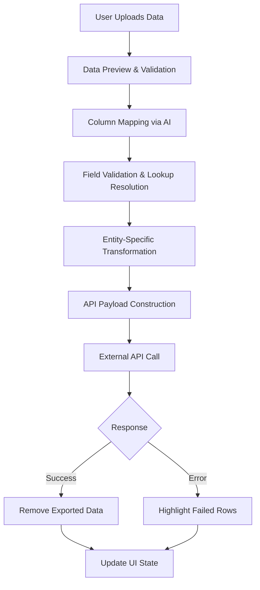
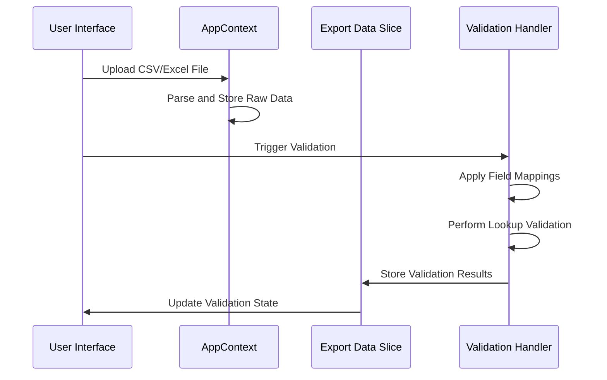
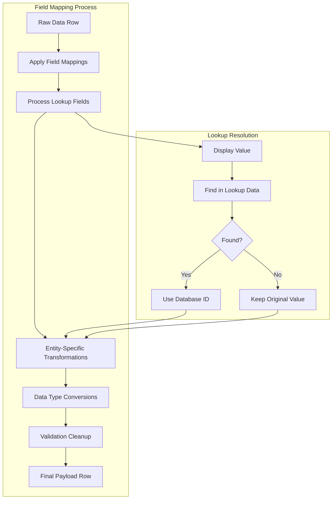
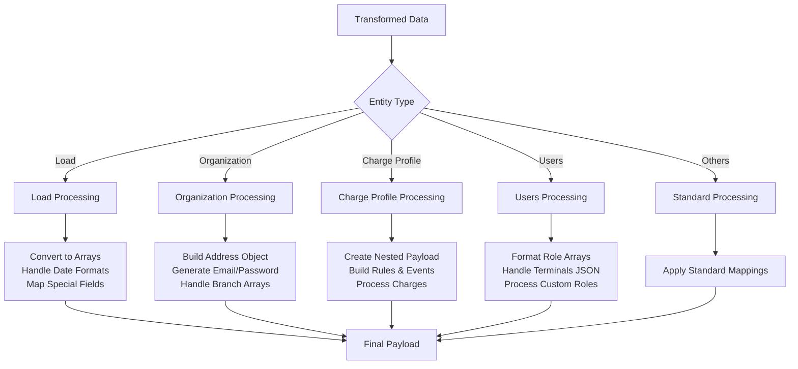
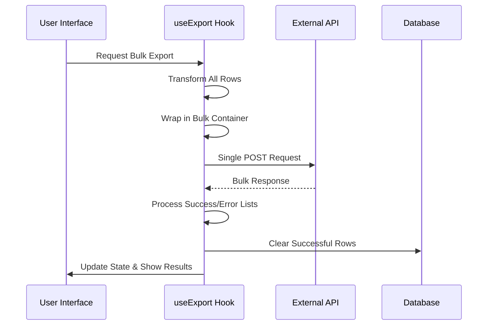
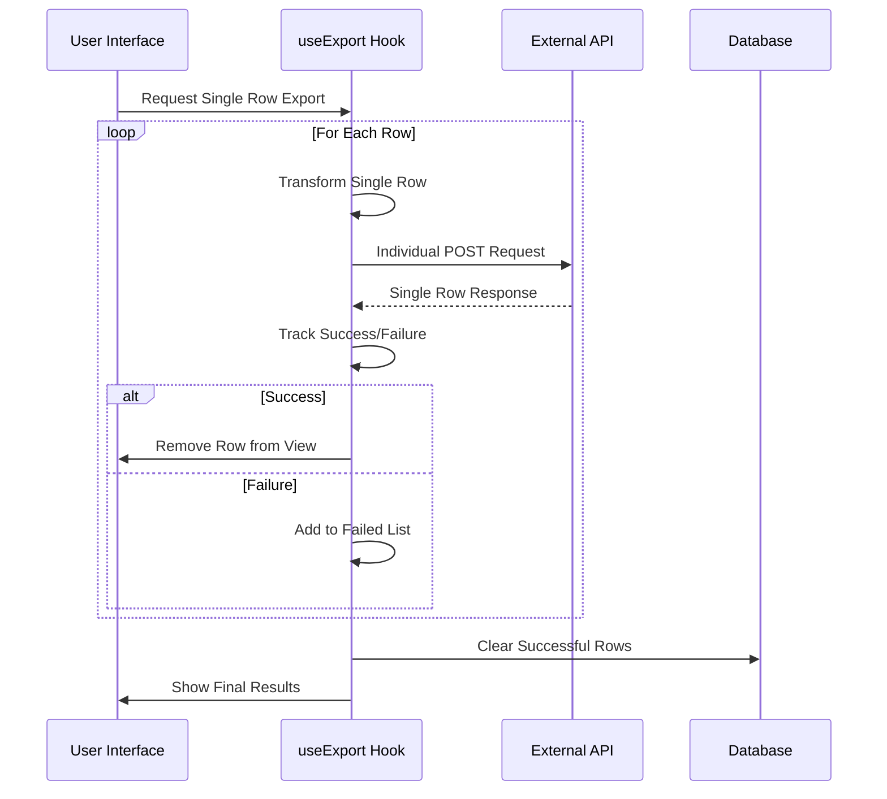
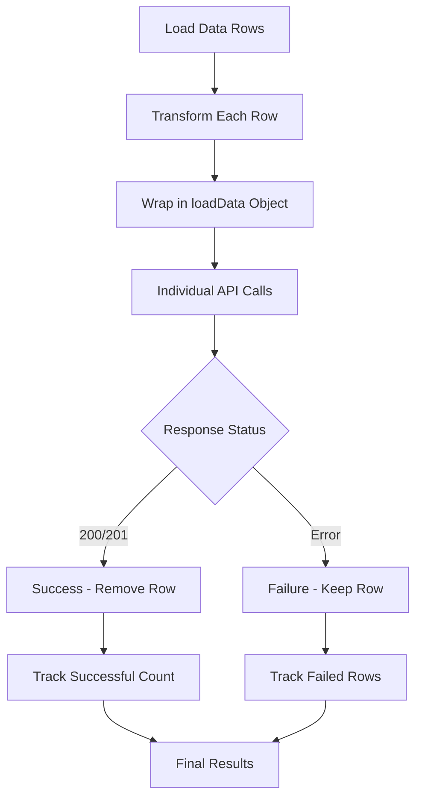
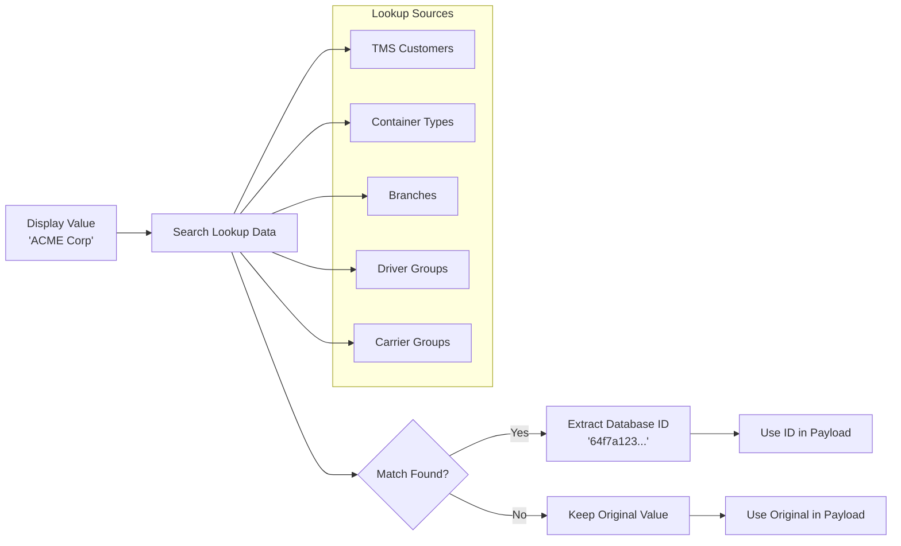
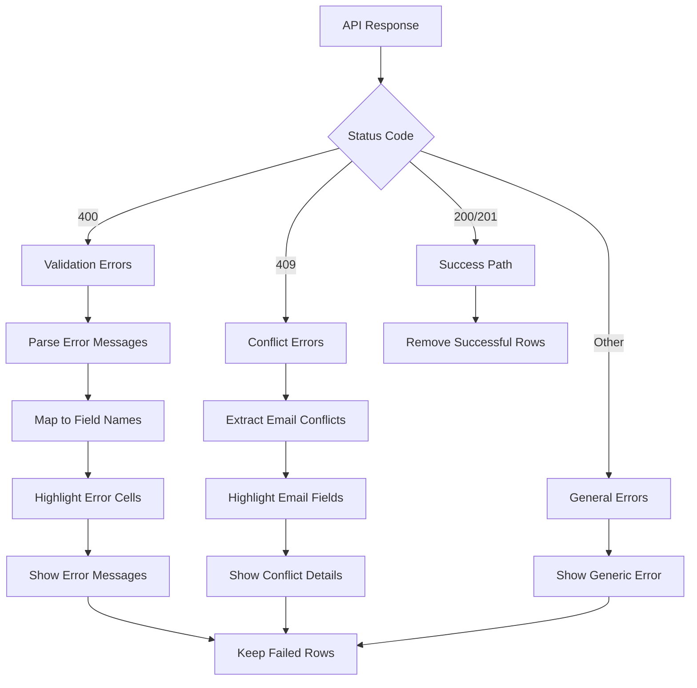

# Data Mapping and API Flow Documentation

This document explains how data flows from the user interface through validation, mapping, and transformation to external API calls in the PortPro Data Bridge AI system.

## Overview

The system processes uploaded data through a sophisticated pipeline that validates, transforms, and maps data to external API endpoints. The process ensures data integrity while handling different entity types with their specific requirements.

## High-Level Architecture Flow



## Core Components

### 1. Entity Configuration System

The `exportEntities.json` file serves as the central configuration for all supported entities:

- **Field Definitions**: Maps UI field names to API field names via `sourceColumn`
- **Validation Rules**: Data types, patterns, required fields, min/max lengths
- **Lookup Relationships**: Defines which fields need ID resolution
- **API Endpoints**: Entity-specific URLs and upload types

### 2. Data Transformation Pipeline

The transformation occurs in multiple stages through the `useExport` hook and `fieldMapper` utility.

## Detailed Process Flow

### Stage 1: Data Collection and Validation



### Stage 2: Field Mapping and Transformation



### Stage 3: Entity-Specific Processing

Different entities require different transformation logic:



## Upload Type Handling

The system supports three different upload patterns:

### Bulk Upload Flow



### Single Row Upload Flow



### Load Entity Special Handling



## Field Mapping Details

### Basic Field Mapping

1. **Source Column Mapping**: Maps UI display names to API field names
2. **Data Type Conversion**: Handles string, number, boolean, date, and array types
3. **Null Value Handling**: Filters null values for specific entities

### Lookup Field Resolution



## Error Handling and Recovery

### Validation Error Processing



### Row State Management

The system maintains different states for data rows:

- **Pending**: Awaiting export
- **Processing**: Currently being exported
- **Success**: Successfully exported (removed from UI)
- **Failed**: Export failed (kept in UI with error highlighting)

## Configuration Files

### exportEntities.json Structure

```json
{
  "baseUrl": "https://api.portpro.io",
  "entities": [
    {
      "id": "EntityName",
      "name": "Display Name",
      "url": "/api/endpoint",
      "uploadType": "BULK_UPLOAD|SINGLE_ROW_UPLOAD",
      "fields": [
        {
          "name": "Display Name",
          "sourceColumn": "api_field_name",
          "type": "string|number|boolean|date",
          "required": true,
          "lookupValidation": {
            "lookupId": "lookupSource",
            "lookupField": "fieldToMatch"
          }
        }
      ]
    }
  ]
}
```

### Key Field Properties

- **name**: Display name shown in UI
- **sourceColumn**: Target API field name
- **type**: Data type for validation and conversion
- **required**: Whether field is mandatory
- **lookupValidation**: Configuration for ID resolution
- **pattern**: Regex pattern for validation
- **minLength/maxLength**: String length constraints

## API Integration Points

### Authentication

All API calls include:
- Bearer token from localStorage
- Standard content-type headers
- Accept headers for JSON responses

### Base URL Resolution

The system dynamically resolves base URLs:
1. Fetches active base URL from database
2. Combines with entity-specific endpoint
3. Handles both relative and absolute URLs

### Response Processing

Different response formats are handled:
- **Bulk Responses**: Process `validList` and `inValidList` arrays
- **Single Responses**: Handle individual success/error status
- **Error Responses**: Extract field-specific error details

## Performance Optimizations

### Batch Processing

- **Bulk Uploads**: Single API call for all rows
- **Lookup Caching**: Redis-based caching for validation data
- **Parallel Processing**: Concurrent API calls where applicable

### Memory Management

- **Pagination**: Process large datasets in chunks
- **State Cleanup**: Remove successful rows from memory
- **Error Isolation**: Keep only failed rows for retry

## Troubleshooting Guide

### Common Issues

1. **Field Mapping Errors**: Check `sourceColumn` values in entity config
2. **Lookup Resolution Failures**: Verify lookup data is loaded and accessible
3. **API Authentication**: Ensure valid bearer token is present
4. **Data Type Mismatches**: Verify field types match API expectations

### Debug Information

The system logs detailed information for:
- Field mapping operations
- Lookup resolution attempts
- API request/response cycles
- Error processing steps

## Related Files

- `src/hooks/useExport.ts` - Main export logic
- `src/utils/fieldMapper.ts` - Data transformation utilities
- `src/contexts/AppContext.tsx` - Application state management
- `exportEntities.json` - Entity configuration
- `src/store/slices/exportDataSlice.ts` - Redux state management