# Entity-Specific Data Transformations

This document details how different entity types are transformed during the data mapping process. Each entity has unique requirements and business logic.

## Entity Transformation Overview

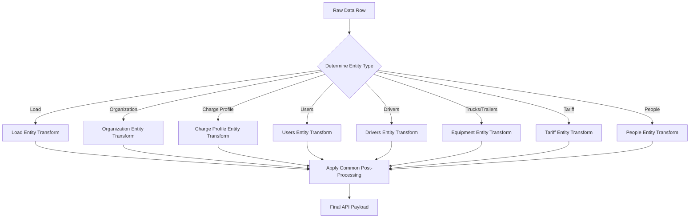

## Load Entity Transformation

The Load entity requires special handling for logistics data with complex field relationships.

### Load Transformation Flow

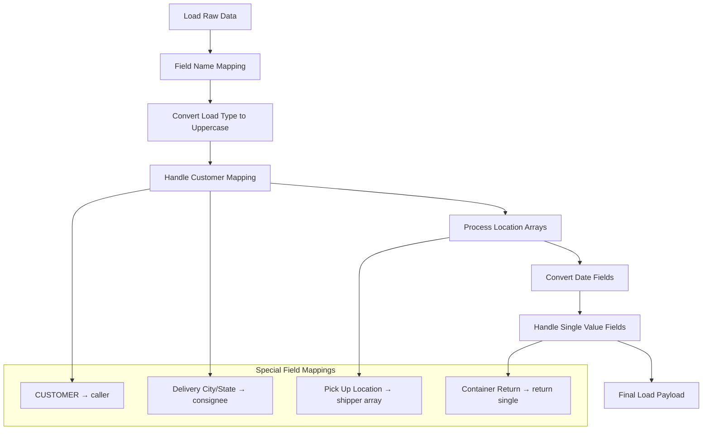

### Key Load Transformations

```typescript
// Type conversion
if (mappedItem.type_of_load) {
  mappedItem.type_of_load = mappedItem.type_of_load.toUpperCase();
}

// Array conversions for locations
if (mappedItem.shipper) {
  mappedItem.shipper = Array.isArray(mappedItem.shipper)
    ? mappedItem.shipper
    : [mappedItem.shipper];
}

// Single value fields
const singleValueFields = ['chassisPick', 'chassisTermination', 'return', 'caller'];
```

## Organization Entity Transformation

Organizations require complex address handling and credential generation.

### Organization Transformation Flow

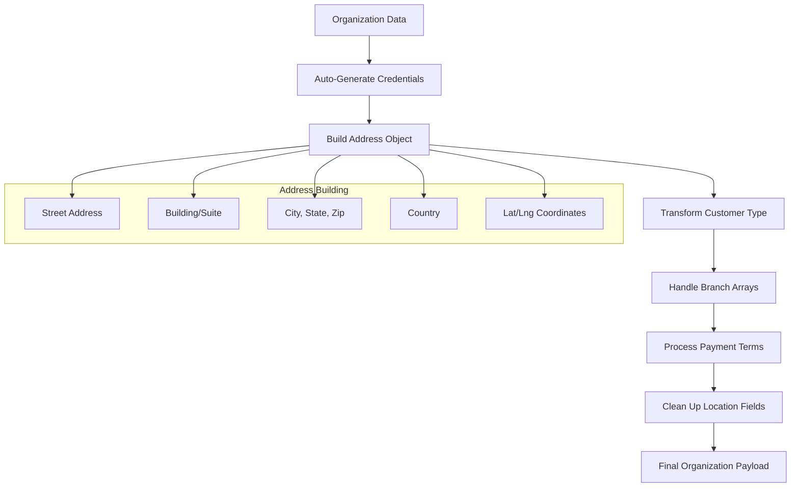

### Organization Address Construction

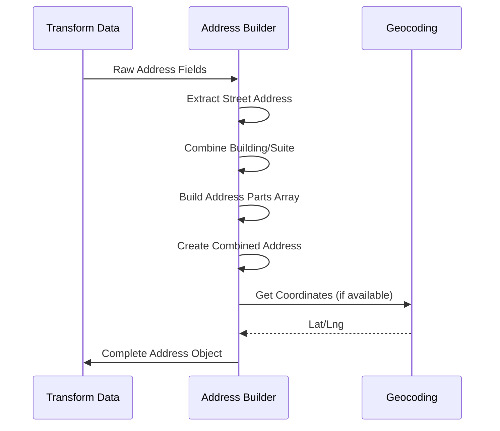

## Charge Profile Entity Transformation

The most complex transformation, creating nested charge templates with rules and events.

### Charge Profile Architecture

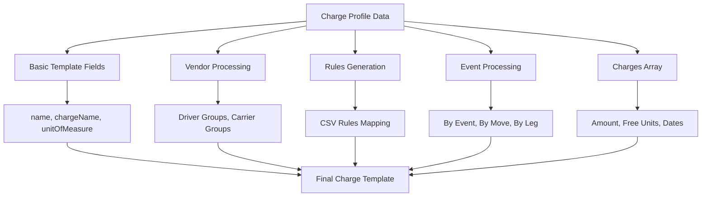

### Event Rule Processing

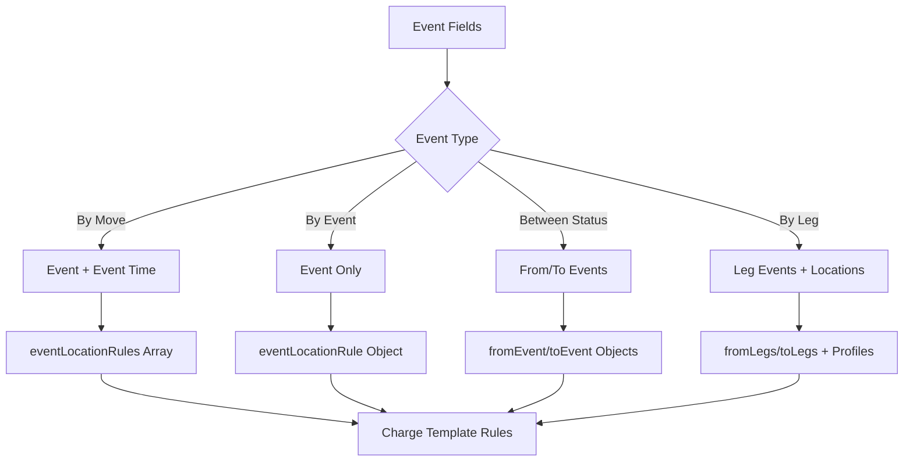

### Rule Generation Logic

The system converts CSV rule fields into complex nested rule structures:

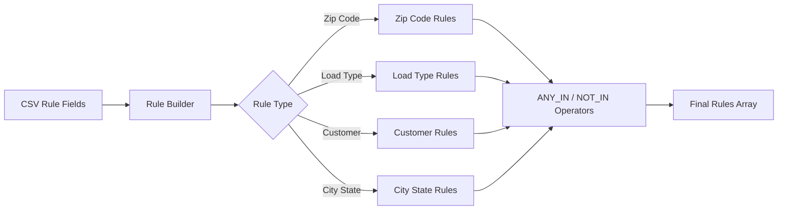

## Users Entity Transformation

Users require role formatting and terminal handling.

### Users Transformation Flow

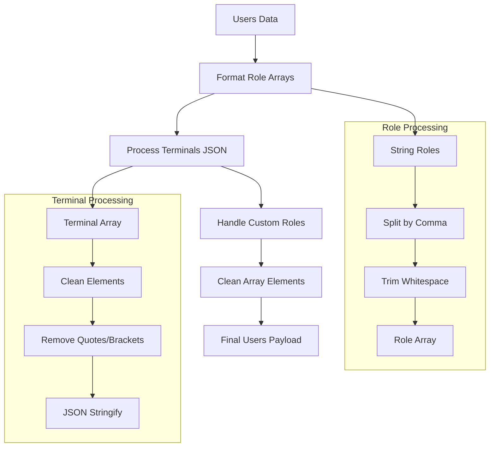

## Drivers Entity Transformation

Drivers need profile type arrays and hazmat boolean conversion.

### Drivers Processing

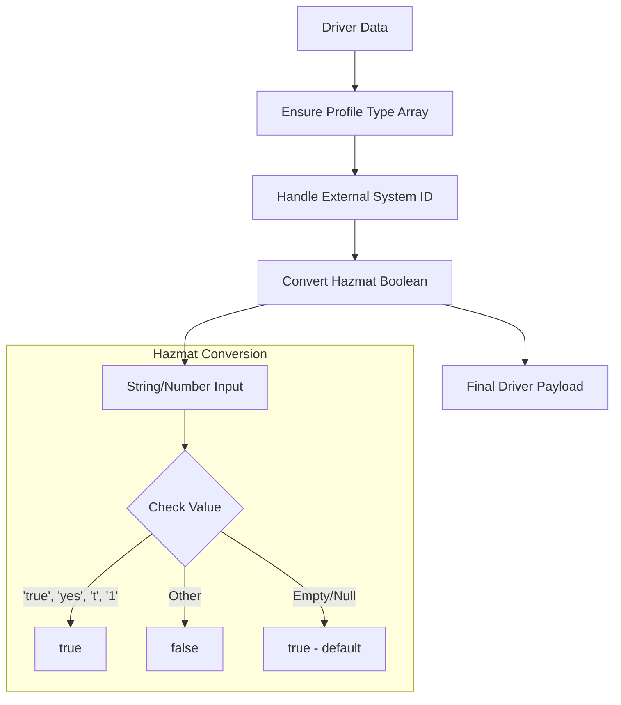

## Equipment Entities (Trucks/Trailers)

Equipment entities share common patterns with type-specific differences.

### Equipment Transformation

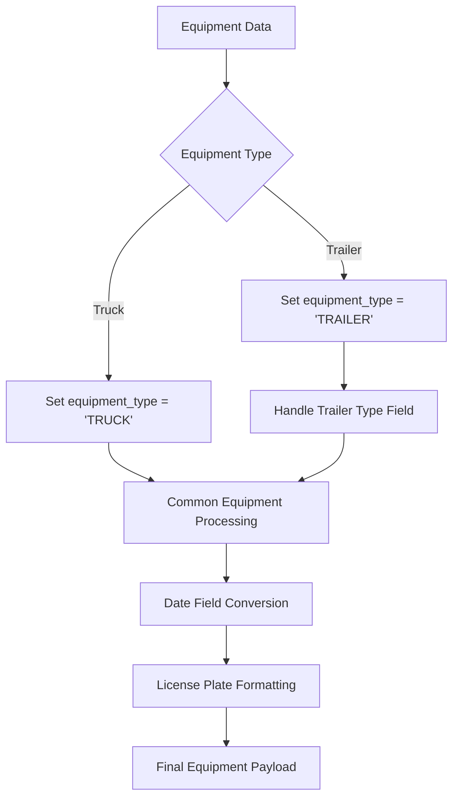

## Tariff Entity Transformation

Tariffs create complex rate structures with customer and location relationships.

### Tariff Structure Building

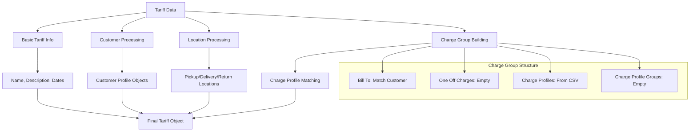

## People Entity Transformation

People entities handle customer permissions and mobile number formatting.

### People Processing Flow

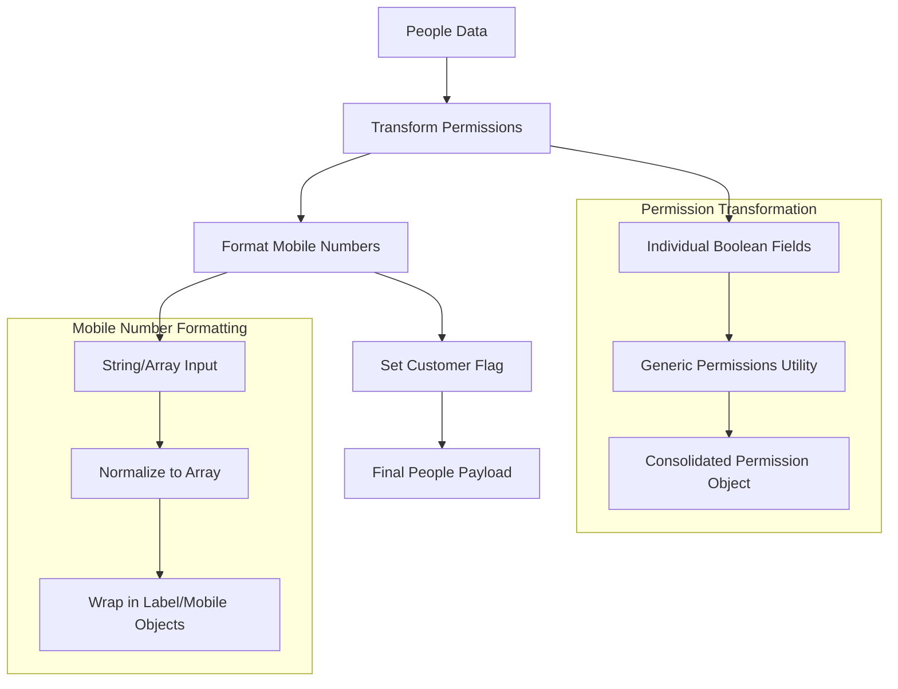

## Common Post-Processing

All entities go through common post-processing steps:

### Date Conversion

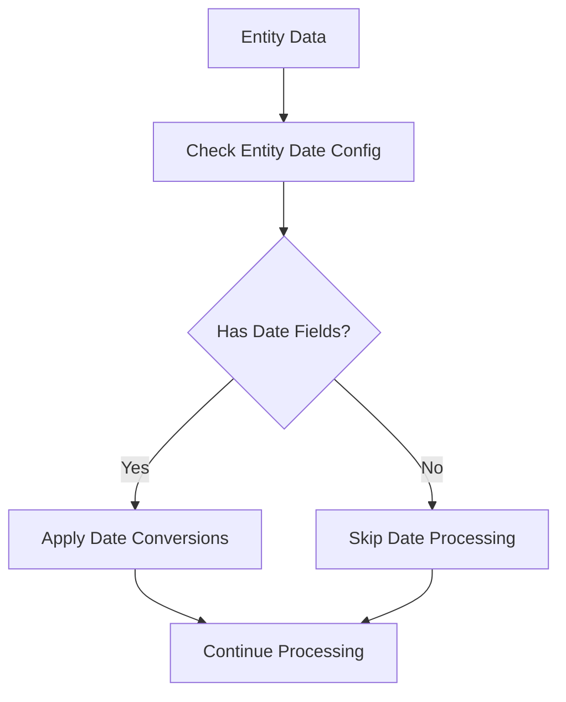

### Null Value Filtering

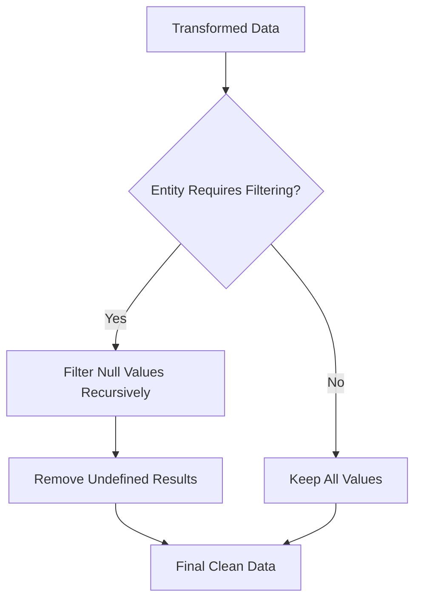

### Location Auto-Fill

For specific entities (Truck Owner, Carrier):

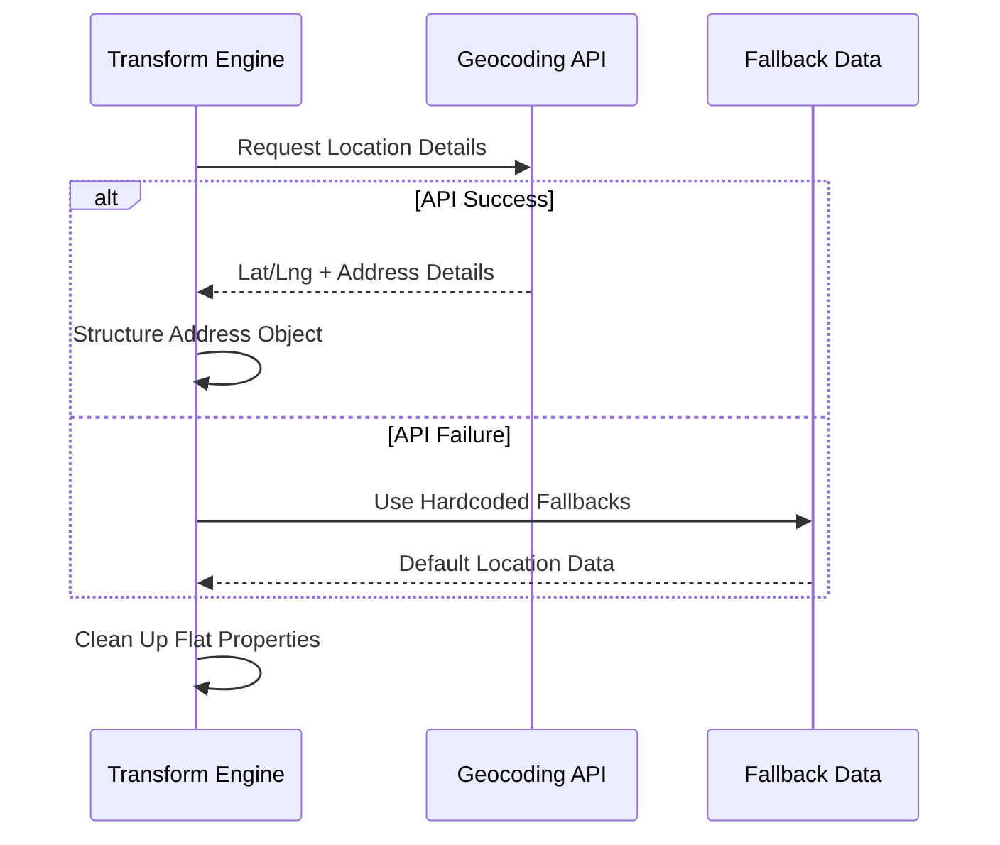

## Transformation Error Handling

Each transformation step includes error handling:

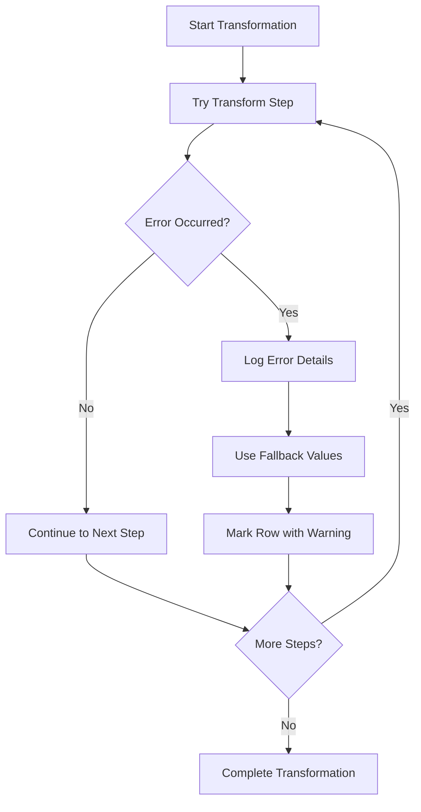

## Field Mapping Reference

### Common Field Types

| UI Field Type | API Transformation | Example |
|---------------|-------------------|---------|
| Text | Direct mapping | `"ACME Corp"` → `"ACME Corp"` |
| Lookup | ID resolution | `"ACME Corp"` → `"64f7a123..."` |
| Date | ISO formatting | `"12/25/2023"` → `"2023-12-25T00:00:00.000Z"` |
| Boolean | String to boolean | `"Yes"` → `true` |
| Array | CSV to array | `"A,B,C"` → `["A","B","C"]` |
| Address | Object structure | Multiple fields → `{address, lat, lng, city, state}` |

### Entity-Specific Mappings

Each entity may override or extend these basic transformations with business logic specific to their domain requirements.

## Related Files

- `src/utils/fieldMapper.ts` - Main transformation logic
- `src/hooks/useExport.ts` - Export orchestration
- `exportEntities.json` - Field configuration
- `src/utils/permissions.ts` - Permission transformations
- `src/utils/dateConverter.ts` - Date conversion utilities