# Error Handling and Recovery System

This document explains the comprehensive error handling and recovery mechanisms implemented in the data export system.

## Error Handling Overview

The system implements multi-layered error handling to ensure data integrity and provide clear user feedback throughout the export process.

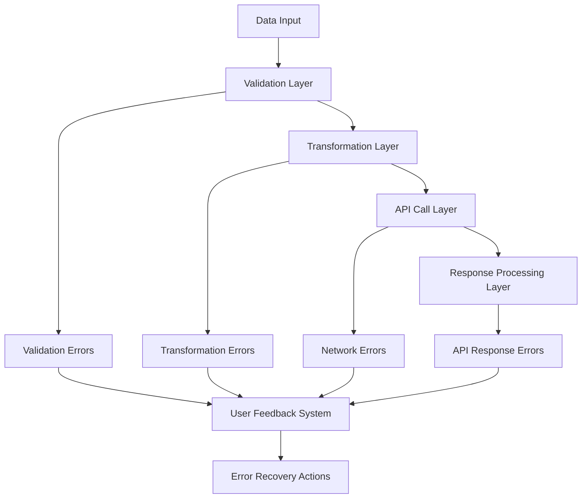
```mermaid
graph TD
    A[Data Input] --> B[Validation Layer]
    B --> C[Transformation Layer]
    C --> D[API Call Layer]
    D --> E[Response Processing Layer]

    B --> F[Validation Errors]
    C --> G[Transformation Errors]
    D --> H[Network Errors]
    E --> I[API Response Errors]

    F --> J[User Feedback System]
    G --> J
    H --> J
    I --> J

    J --> K[Error Recovery Actions]
```

## Error Categories

### 1. Validation Errors

Errors that occur during data validation before API calls:

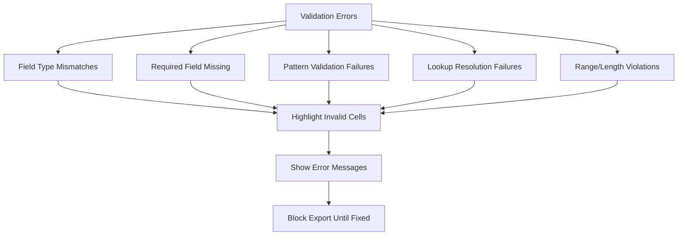
```mermaid
graph TD
    A[Validation Errors] --> B[Field Type Mismatches]
    A --> C[Required Field Missing]
    A --> D[Pattern Validation Failures]
    A --> E[Lookup Resolution Failures]
    A --> F[Range/Length Violations]

    B --> G[Highlight Invalid Cells]
    C --> G
    D --> G
    E --> G
    F --> G

    G --> H[Show Error Messages]
    H --> I[Block Export Until Fixed]
```

### 2. Transformation Errors

Errors during data transformation and mapping:

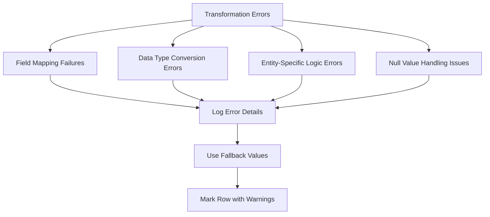
```mermaid
graph TD
    A[Transformation Errors] --> B[Field Mapping Failures]
    A --> C[Data Type Conversion Errors]
    A --> D[Entity-Specific Logic Errors]
    A --> E[Null Value Handling Issues]

    B --> F[Log Error Details]
    C --> F
    D --> F
    E --> F

    F --> G[Use Fallback Values]
    G --> H[Mark Row with Warnings]
```

### 3. Network Errors

Connection and communication errors:

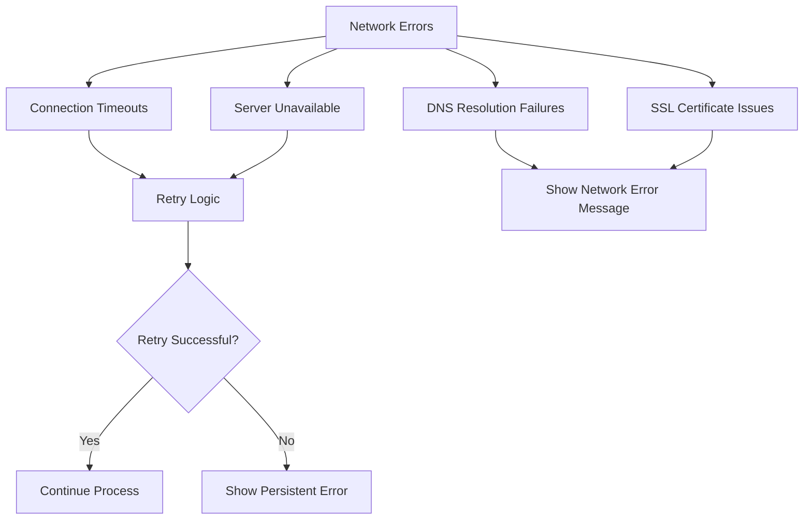
```mermaid
graph TD
    A[Network Errors] --> B[Connection Timeouts]
    A --> C[DNS Resolution Failures]
    A --> D[SSL Certificate Issues]
    A --> E[Server Unavailable]

    B --> F[Retry Logic]
    C --> G[Show Network Error Message]
    D --> G
    E --> F

    F --> H{Retry Successful?}
    H -->|Yes| I[Continue Process]
    H -->|No| J[Show Persistent Error]
```

### 4. API Response Errors

Errors returned by external APIs:

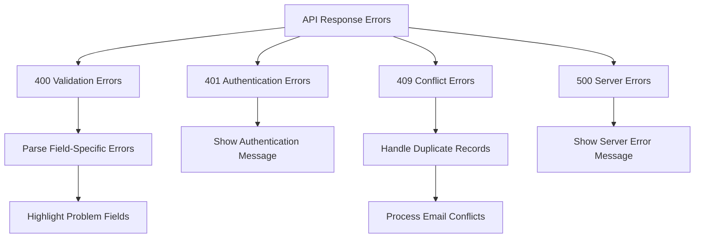
```mermaid
graph TD
    A[API Response Errors] --> B[400 Validation Errors]
    A --> C[401 Authentication Errors]
    A --> D[409 Conflict Errors]
    A --> E[500 Server Errors]

    B --> F[Parse Field-Specific Errors]
    C --> G[Show Authentication Message]
    D --> H[Handle Duplicate Records]
    E --> I[Show Server Error Message]

    F --> J[Highlight Problem Fields]
    H --> K[Process Email Conflicts]
```

## Error Processing Flow

### Bulk Upload Error Handling

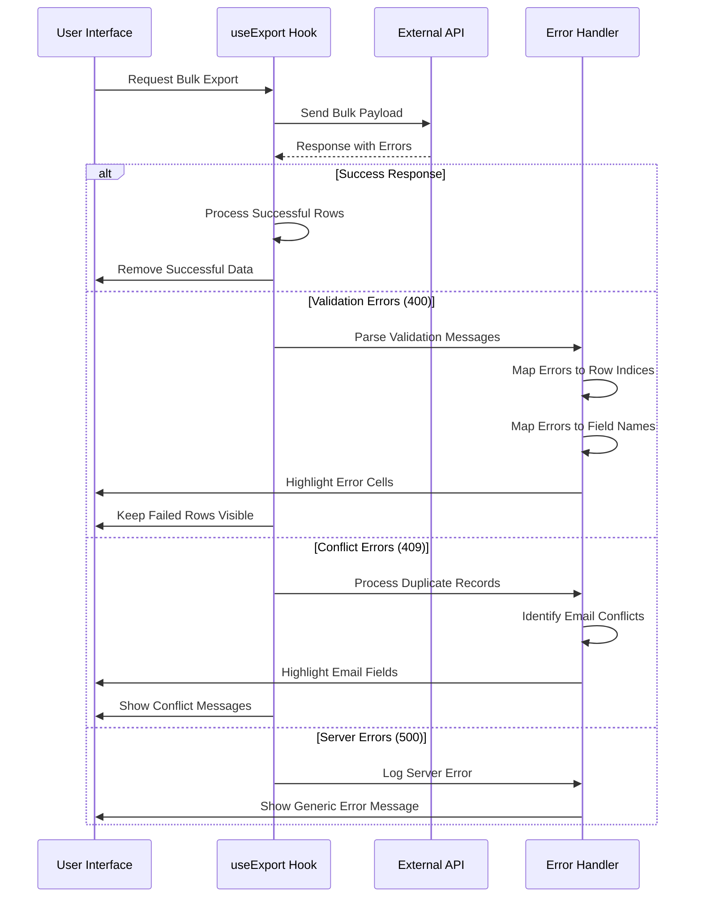
```mermaid
sequenceDiagram
    participant UI as User Interface
    participant UE as useExport Hook
    participant API as External API
    participant EH as Error Handler

    UI->>UE: Request Bulk Export
    UE->>API: Send Bulk Payload
    API-->>UE: Response with Errors

    alt Success Response
        UE->>UE: Process Successful Rows
        UE->>UI: Remove Successful Data
    else Validation Errors (400)
        UE->>EH: Parse Validation Messages
        EH->>EH: Map Errors to Row Indices
        EH->>EH: Map Errors to Field Names
        EH->>UI: Highlight Error Cells
        UE->>UI: Keep Failed Rows Visible
    else Conflict Errors (409)
        UE->>EH: Process Duplicate Records
        EH->>EH: Identify Email Conflicts
        EH->>UI: Highlight Email Fields
        UE->>UI: Show Conflict Messages
    else Server Errors (500)
        UE->>EH: Log Server Error
        EH->>UI: Show Generic Error Message
    end
```

### Single Row Error Handling

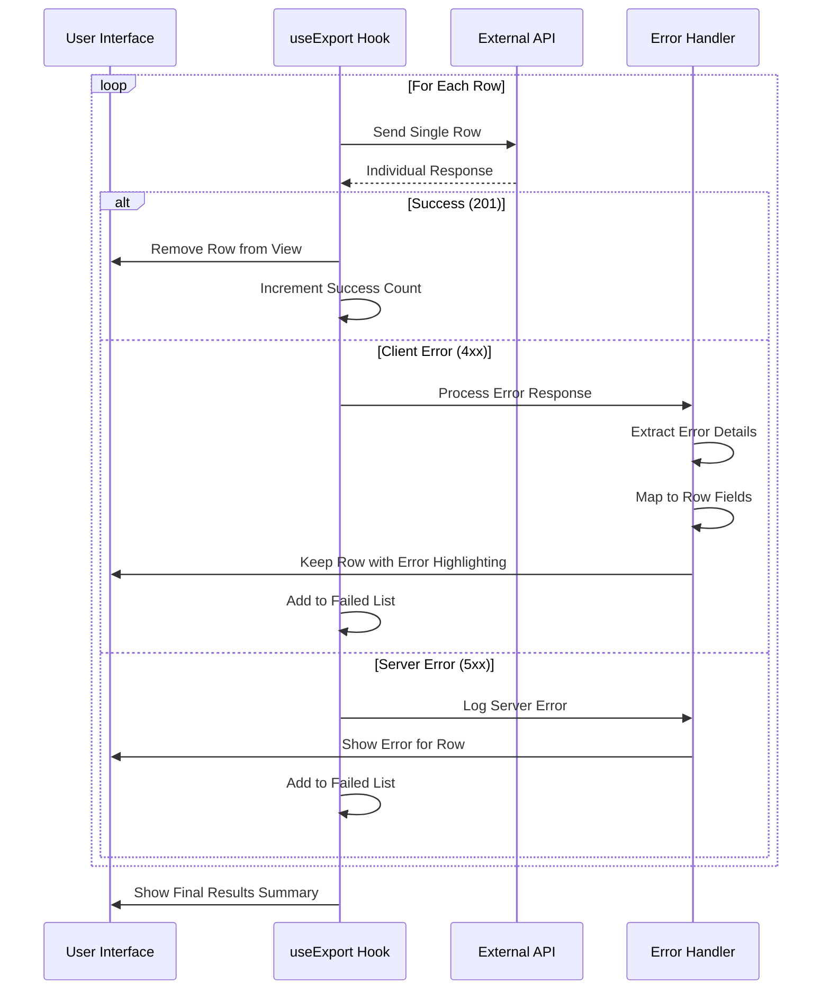
```mermaid
sequenceDiagram
    participant UI as User Interface
    participant UE as useExport Hook
    participant API as External API
    participant EH as Error Handler

    loop For Each Row
        UE->>API: Send Single Row
        API-->>UE: Individual Response

        alt Success (201)
            UE->>UI: Remove Row from View
            UE->>UE: Increment Success Count
        else Client Error (4xx)
            UE->>EH: Process Error Response
            EH->>EH: Extract Error Details
            EH->>EH: Map to Row Fields
            EH->>UI: Keep Row with Error Highlighting
            UE->>UE: Add to Failed List
        else Server Error (5xx)
            UE->>EH: Log Server Error
            EH->>UI: Show Error for Row
            UE->>UE: Add to Failed List
        end
    end

    UE->>UI: Show Final Results Summary
```

## Error Response Processing

### Validation Error Parsing

The system handles different validation error formats:

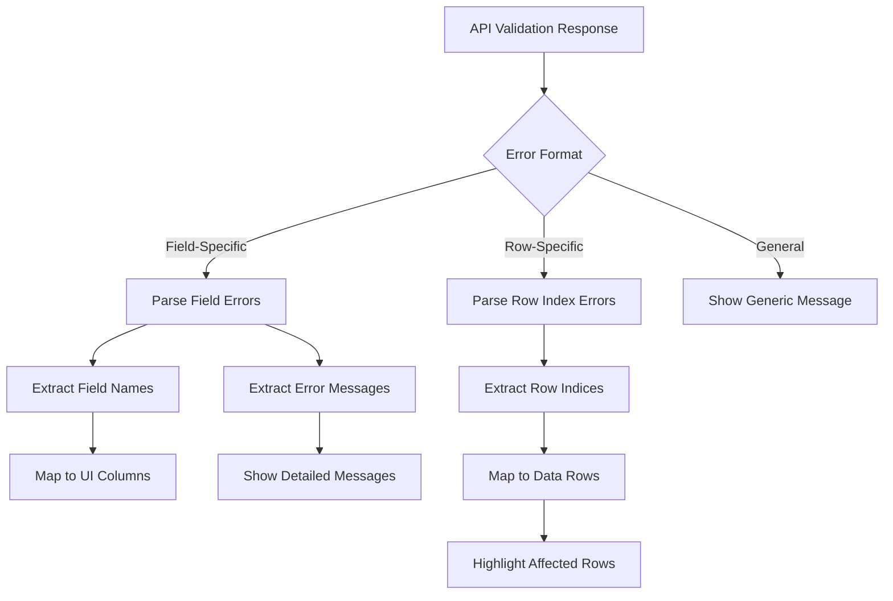
```mermaid
graph TD
    A[API Validation Response] --> B{Error Format}

    B -->|Field-Specific| C[Parse Field Errors]
    B -->|Row-Specific| D[Parse Row Index Errors]
    B -->|General| E[Show Generic Message]

    C --> F[Extract Field Names]
    C --> G[Extract Error Messages]
    F --> H[Map to UI Columns]
    G --> I[Show Detailed Messages]

    D --> J[Extract Row Indices]
    J --> K[Map to Data Rows]
    K --> L[Highlight Affected Rows]
```

#### Example Error Parsing

For bulk validation errors:
```typescript
// Input: "0.customRole must be a string. data[1].customRole must be a string..."
const validationErrors = responseData.message.split('. ');

for (const errorMsg of validationErrors) {
  const match = errorMsg.match(/^(?:data\[)?(\d+)(?:\])?\.(\w+)\s+must\s+be\s+a\s+(\w+)/);
  if (match) {
    const rowIndex = parseInt(match[1], 10);
    const fieldName = match[2];
    const expectedType = match[3];

    // Map error to specific row and field
  }
}
```

### Email Conflict Handling

Special handling for duplicate email addresses:

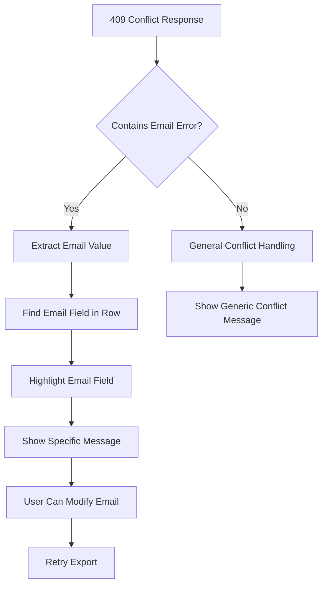
```mermaid
graph TD
    A[409 Conflict Response] --> B{Contains Email Error?}
    B -->|Yes| C[Extract Email Value]
    B -->|No| D[General Conflict Handling]

    C --> E[Find Email Field in Row]
    E --> F[Highlight Email Field]
    F --> G[Show Specific Message]

    D --> H[Show Generic Conflict Message]

    G --> I[User Can Modify Email]
    I --> J[Retry Export]
```

## Error State Management

### Redux Error State

The system maintains comprehensive error state in Redux:

```typescript
interface ErrorState {
  errorRows: number[];           // Rows with errors
  errorCells: Record<string, string[]>; // Column -> Row indices
  errorMessages: Record<string, string>; // Cell key -> Error message
  totalErrorCount: number;       // Total error count
  hasValidated: boolean;         // Validation status
  isDataValid: boolean;         // Overall validity
  validationMessages: string[]; // General messages
}
```

### Error State Flow

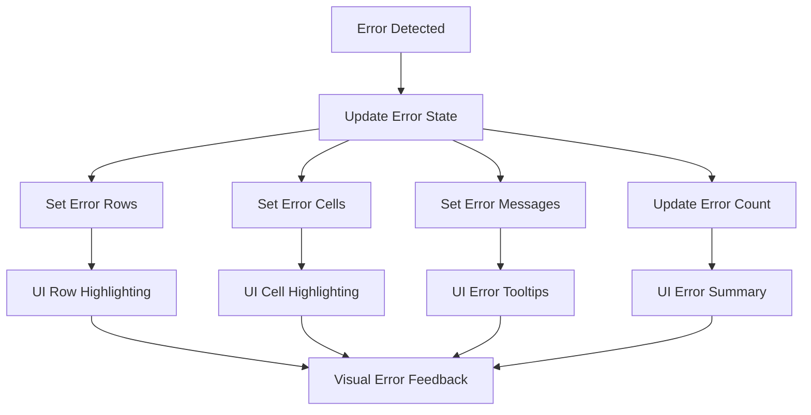
```mermaid
graph TD
    A[Error Detected] --> B[Update Error State]
    B --> C[Set Error Rows]
    B --> D[Set Error Cells]
    B --> E[Set Error Messages]
    B --> F[Update Error Count]

    C --> G[UI Row Highlighting]
    D --> H[UI Cell Highlighting]
    E --> I[UI Error Tooltips]
    F --> J[UI Error Summary]

    G --> K[Visual Error Feedback]
    H --> K
    I --> K
    J --> K
```

## Recovery Mechanisms

### Automatic Recovery

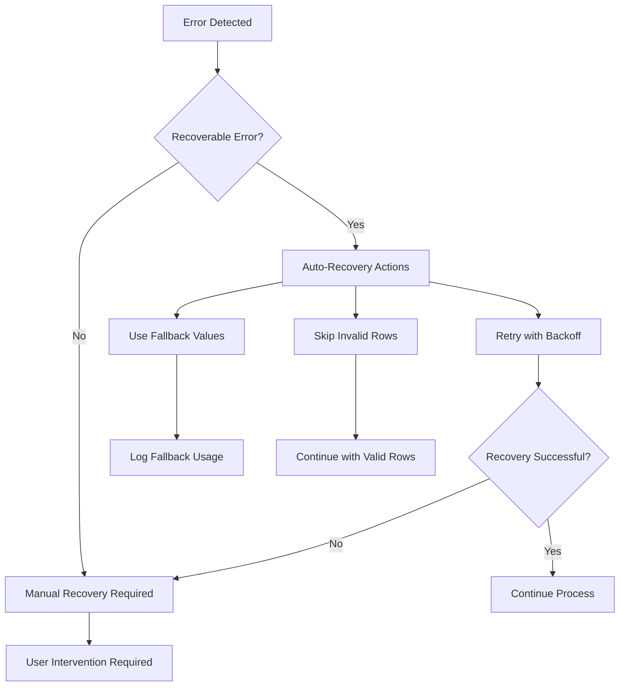
```mermaid
graph TD
    A[Error Detected] --> B{Recoverable Error?}
    B -->|Yes| C[Auto-Recovery Actions]
    B -->|No| D[Manual Recovery Required]

    C --> E[Retry with Backoff]
    C --> F[Use Fallback Values]
    C --> G[Skip Invalid Rows]

    E --> H{Recovery Successful?}
    F --> I[Log Fallback Usage]
    G --> J[Continue with Valid Rows]

    H -->|Yes| K[Continue Process]
    H -->|No| D

    D --> L[User Intervention Required]
```

### Retry Logic

For transient errors, the system implements exponential backoff:

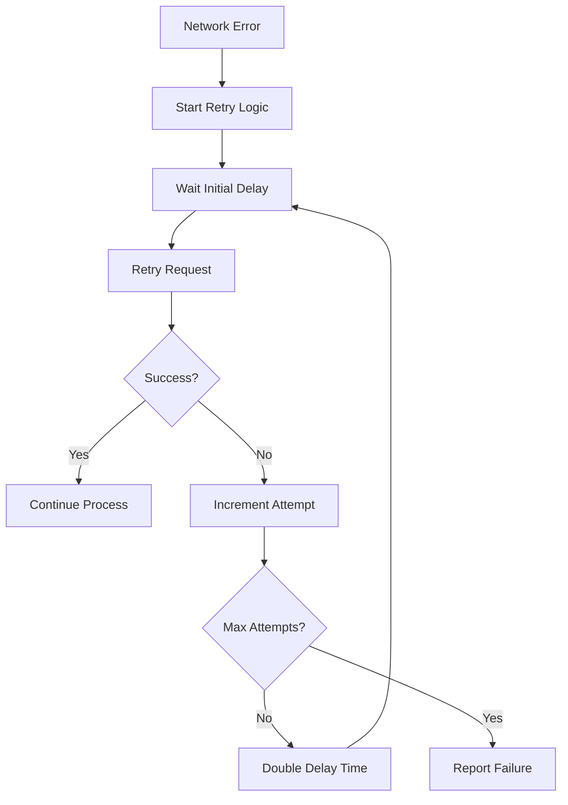
```mermaid
graph TD
    A[Network Error] --> B[Start Retry Logic]
    B --> C[Wait Initial Delay]
    C --> D[Retry Request]
    D --> E{Success?}
    E -->|Yes| F[Continue Process]
    E -->|No| G[Increment Attempt]
    G --> H{Max Attempts?}
    H -->|No| I[Double Delay Time]
    I --> C
    H -->|Yes| J[Report Failure]
```

### Data Recovery Actions

When errors occur, the system provides several recovery options:

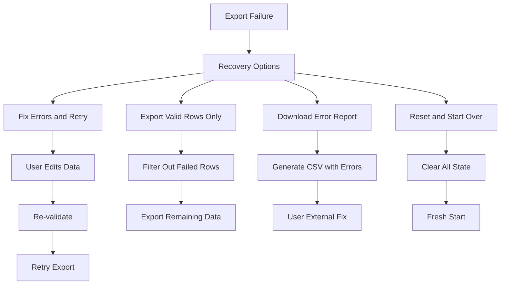
```mermaid
graph TD
    A[Export Failure] --> B[Recovery Options]

    B --> C[Fix Errors and Retry]
    B --> D[Export Valid Rows Only]
    B --> E[Download Error Report]
    B --> F[Reset and Start Over]

    C --> G[User Edits Data]
    G --> H[Re-validate]
    H --> I[Retry Export]

    D --> J[Filter Out Failed Rows]
    J --> K[Export Remaining Data]

    E --> L[Generate CSV with Errors]
    L --> M[User External Fix]

    F --> N[Clear All State]
    N --> O[Fresh Start]
```

## Error Highlighting System

### Cell-Level Error Highlighting

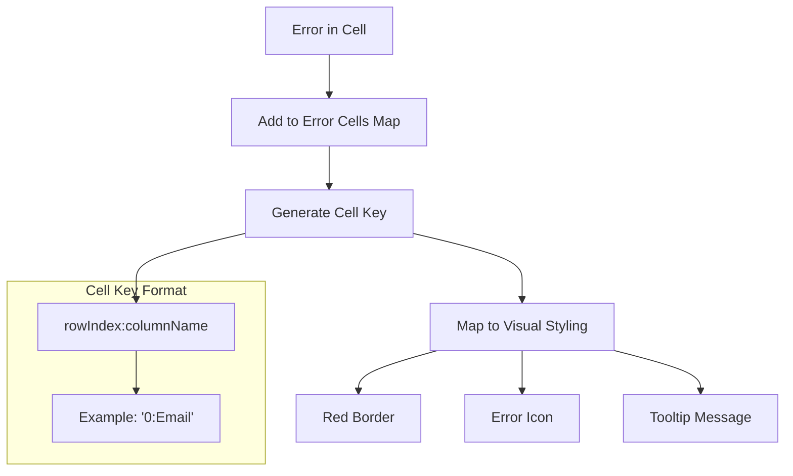
```mermaid
graph TD
    A[Error in Cell] --> B[Add to Error Cells Map]
    B --> C[Generate Cell Key]
    C --> D[Map to Visual Styling]

    subgraph "Cell Key Format"
        E["rowIndex:columnName"]
        F["Example: '0:Email'"]
    end

    C --> E
    E --> F

    D --> G[Red Border]
    D --> H[Error Icon]
    D --> I[Tooltip Message]
```

### Row-Level Error Highlighting

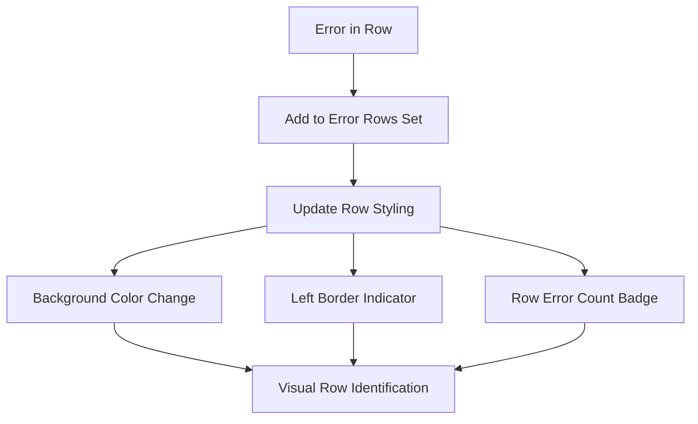
```mermaid
graph TD
    A[Error in Row] --> B[Add to Error Rows Set]
    B --> C[Update Row Styling]

    C --> D[Background Color Change]
    C --> E[Left Border Indicator]
    C --> F[Row Error Count Badge]

    D --> G[Visual Row Identification]
    E --> G
    F --> G
```

## Error Message System

### Message Prioritization

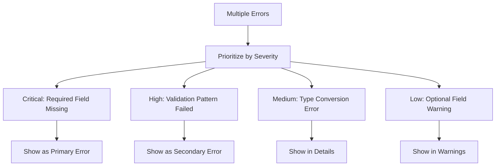
```mermaid
graph TD
    A[Multiple Errors] --> B[Prioritize by Severity]

    B --> C[Critical: Required Field Missing]
    B --> D[High: Validation Pattern Failed]
    B --> E[Medium: Type Conversion Error]
    B --> F[Low: Optional Field Warning]

    C --> G[Show as Primary Error]
    D --> H[Show as Secondary Error]
    E --> I[Show in Details]
    F --> J[Show in Warnings]
```

### Contextual Error Messages

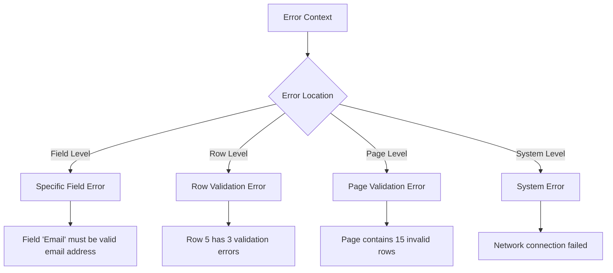
```mermaid
graph TD
    A[Error Context] --> B{Error Location}

    B -->|Field Level| C[Specific Field Error]
    B -->|Row Level| D[Row Validation Error]
    B -->|Page Level| E[Page Validation Error]
    B -->|System Level| F[System Error]

    C --> G["Field 'Email' must be valid email address"]
    D --> H["Row 5 has 3 validation errors"]
    E --> I["Page contains 15 invalid rows"]
    F --> J["Network connection failed"]
```

## Error Logging and Debugging

### Error Logging Levels

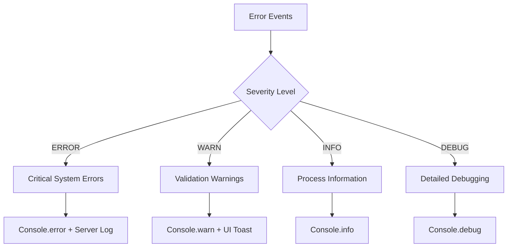
```mermaid
graph TD
    A[Error Events] --> B{Severity Level}

    B -->|ERROR| C[Critical System Errors]
    B -->|WARN| D[Validation Warnings]
    B -->|INFO| E[Process Information]
    B -->|DEBUG| F[Detailed Debugging]

    C --> G[Console.error + Server Log]
    D --> H[Console.warn + UI Toast]
    E --> I[Console.info]
    F --> J[Console.debug]
```

### Debug Information

For troubleshooting, the system logs:

- Field mapping operations
- Lookup resolution attempts
- API request/response cycles
- Error processing steps
- State changes
- User actions

## User Experience During Errors

### Progressive Error Disclosure

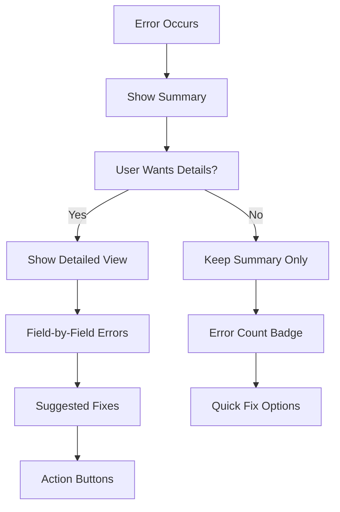
```mermaid
graph TD
    A[Error Occurs] --> B[Show Summary]
    B --> C[User Wants Details?]
    C -->|Yes| D[Show Detailed View]
    C -->|No| E[Keep Summary Only]

    D --> F[Field-by-Field Errors]
    F --> G[Suggested Fixes]
    G --> H[Action Buttons]

    E --> I[Error Count Badge]
    I --> J[Quick Fix Options]
```

### Error Recovery Workflow

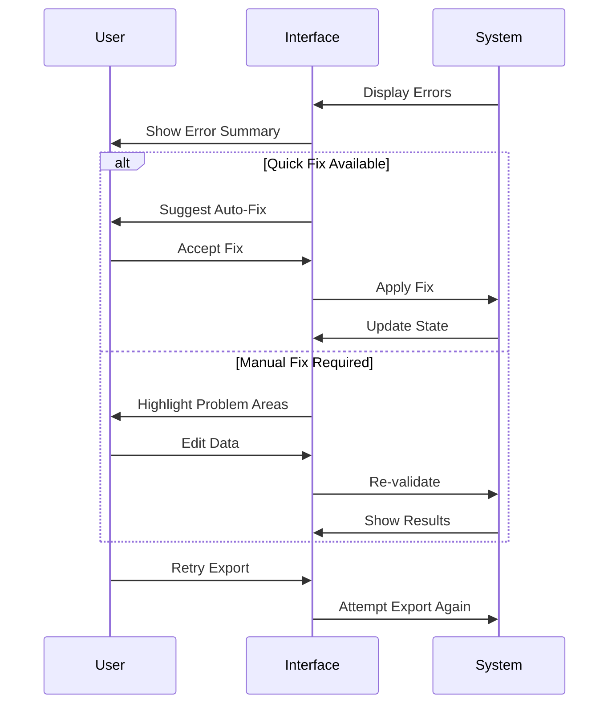
```mermaid
sequenceDiagram
    participant U as User
    participant UI as Interface
    participant S as System

    S->>UI: Display Errors
    UI->>U: Show Error Summary

    alt Quick Fix Available
        UI->>U: Suggest Auto-Fix
        U->>UI: Accept Fix
        UI->>S: Apply Fix
        S->>UI: Update State
    else Manual Fix Required
        UI->>U: Highlight Problem Areas
        U->>UI: Edit Data
        UI->>S: Re-validate
        S->>UI: Show Results
    end

    U->>UI: Retry Export
    UI->>S: Attempt Export Again
```

## Error Prevention Strategies

### Proactive Validation

```mermaid
graph TD
    A[Data Input] --> B[Real-time Validation]
    B --> C[Format Validation]
    B --> D[Type Checking]
    B --> E[Lookup Validation]
    B --> F[Business Rule Validation]

    C --> G[Immediate Feedback]
    D --> G
    E --> G
    F --> G

    G --> H[Prevent Invalid Data Entry]
```

### Data Quality Checks

```mermaid
graph TD
    A[Pre-Export Checks] --> B[Required Field Coverage]
    A --> C[Data Type Consistency]
    A --> D[Lookup Value Validity]
    A --> E[Business Rule Compliance]

    B --> F{All Checks Pass?}
    C --> F
    D --> F
    E --> F

    F -->|Yes| G[Allow Export]
    F -->|No| H[Block Export with Details]
```

## Related Files

- `src/hooks/useExport.ts` - Main error handling logic
- `src/store/slices/exportDataSlice.ts` - Error state management
- `src/contexts/AppContext.tsx` - Application error context
- `src/components/ui/` - Error UI components
- `src/utils/fieldMapper.ts` - Transformation error handling