# Lookup System Architecture

This document explains the lookup validation system that converts human-readable display values to database IDs during the data export process.

## Overview

The lookup system is a critical component that ensures data integrity by validating user inputs against authoritative data sources and converting display names to the corresponding database IDs required by external APIs.

## Lookup System Flow

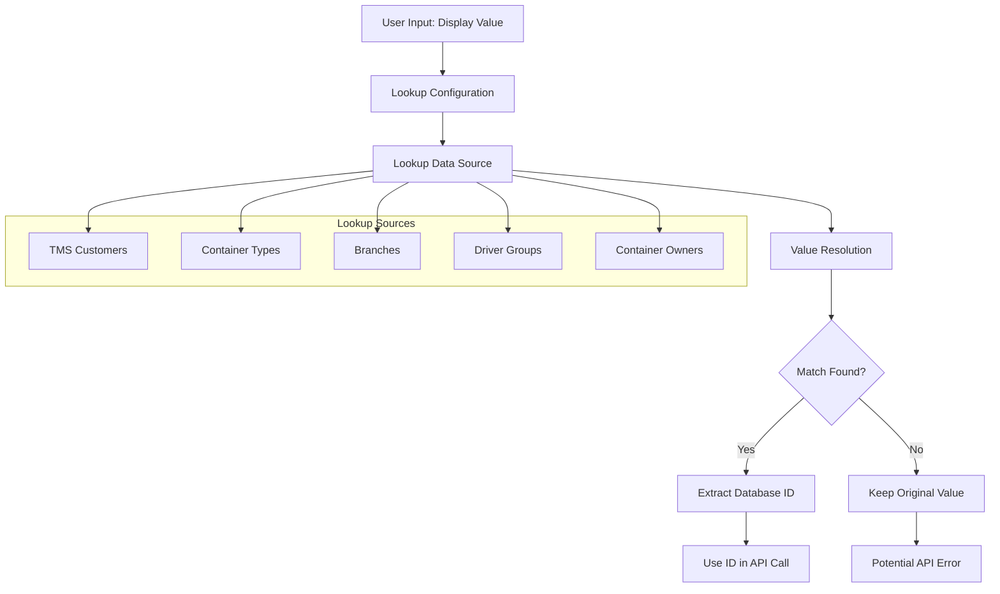

## Lookup Configuration

### Entity Field Configuration

Each field that requires lookup validation is configured in `exportEntities.json`:

```json
{
  "name": "Customer",
  "sourceColumn": "caller",
  "type": "string",
  "required": true,
  "lookupValidation": {
    "lookupId": "tmsCustomers",
    "lookupField": "company_name"
  }
}
```

### Lookup Data Sources

The system maintains various lookup data sources:

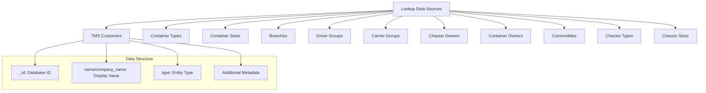

## Lookup Resolution Process

### Basic Lookup Flow

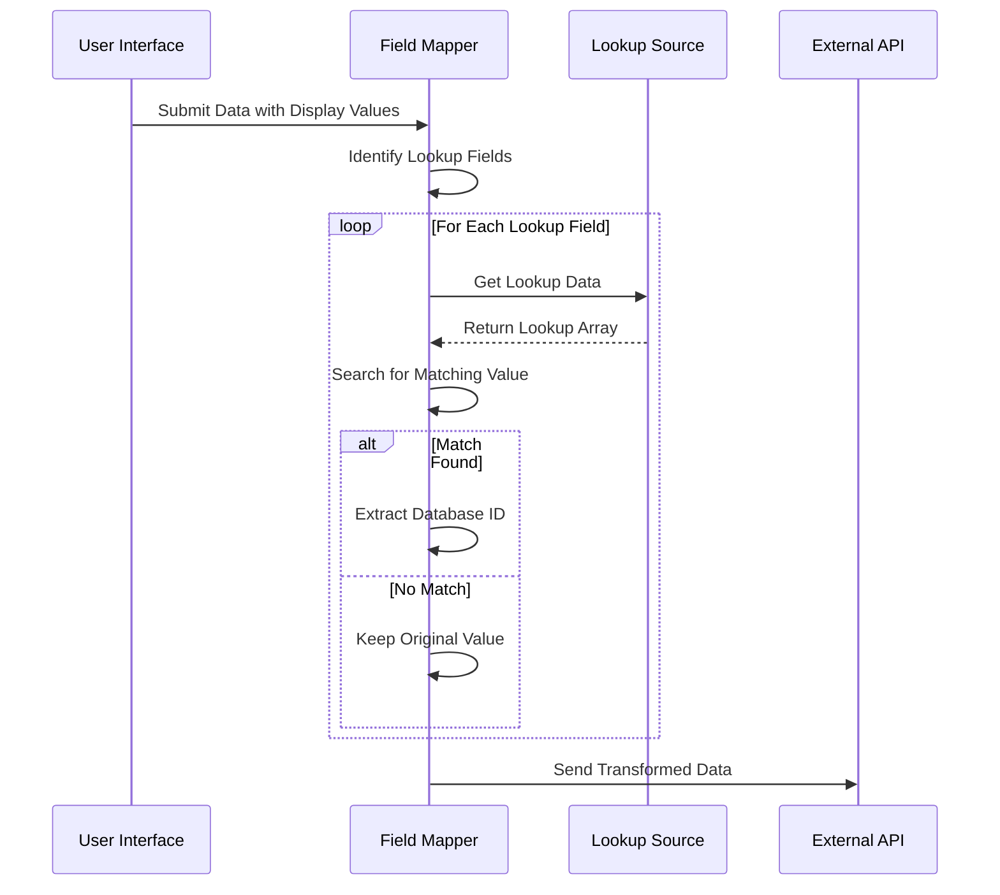

### Multi-Value Lookup Resolution

For comma-separated values:

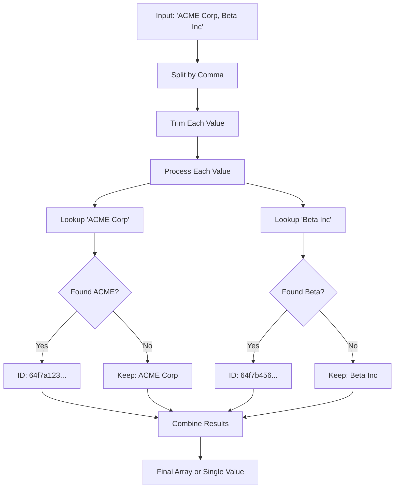

## Lookup Data Sources Detail

### TMS Customers

Used for all customer-related fields:

```typescript
interface TMSCustomer {
  _id: string;
  company_name: string;
  type: string;
  address?: Address;
  city?: string;
  state?: string;
  country?: string;
  zip_code?: string;
}
```

### Container Types/Sizes/Owners

Used for container-related logistics data:

```typescript
interface ContainerLookup {
  _id: string;
  name: string;
  type?: string;
  company_name?: string; // For owners
}
```

### Branches/Terminals

Used for location-based fields:

```typescript
interface Branch {
  _id: string;
  name: string;
  type: 'terminal' | 'branch';
  address?: Address;
  timezone?: string;
}
```

### Driver/Carrier Groups

Used for charge profiles and user assignments:

```typescript
interface DriverGroup {
  _id: string;
  name: string;
  type: 'driver' | 'carrier';
  profiles?: Profile[];
}
```

## Special Lookup Handling

### "All" Values

The system handles special "All" values that represent all items in a lookup:

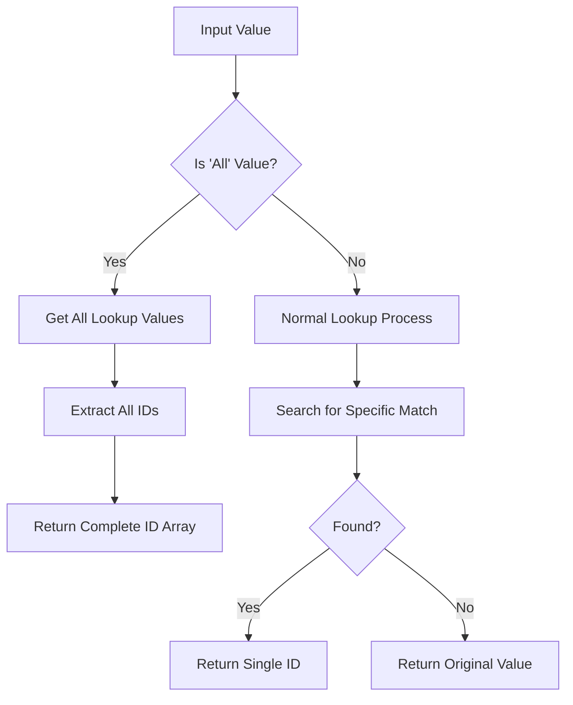

Special "All" patterns recognized:
- `"all"`
- `"All Customers"`
- `"All Container Types"`
- `"All Driver Groups"`

### Fleet Owner Special Handling

Fleet Owners have special comma handling due to company names containing commas:

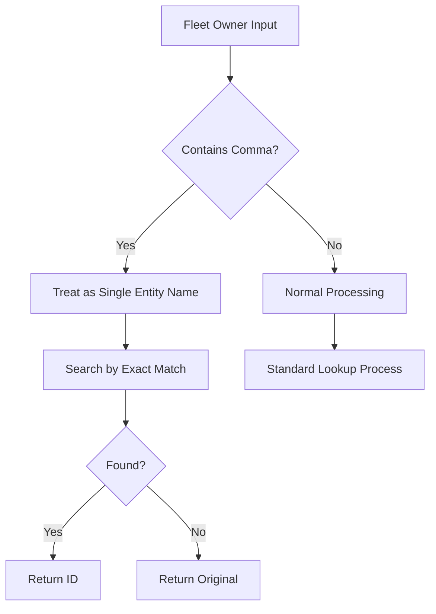

## Lookup Key Mapping

The system uses a lookup key mapper to handle different naming conventions:

```typescript
const LookupKeyMapper: Record<string, string> = {
  'tmsCustomers': 'customers',
  'containerTypes': 'containerTypes',
  'branches': 'branches',
  'driverGroups': 'driverGroups',
  'fleetOwners': 'fleetTruckOwners'
};
```

This allows flexible configuration while maintaining consistent internal naming.

## Validation-Only Fields

Some fields are validated against lookups but keep their original values:

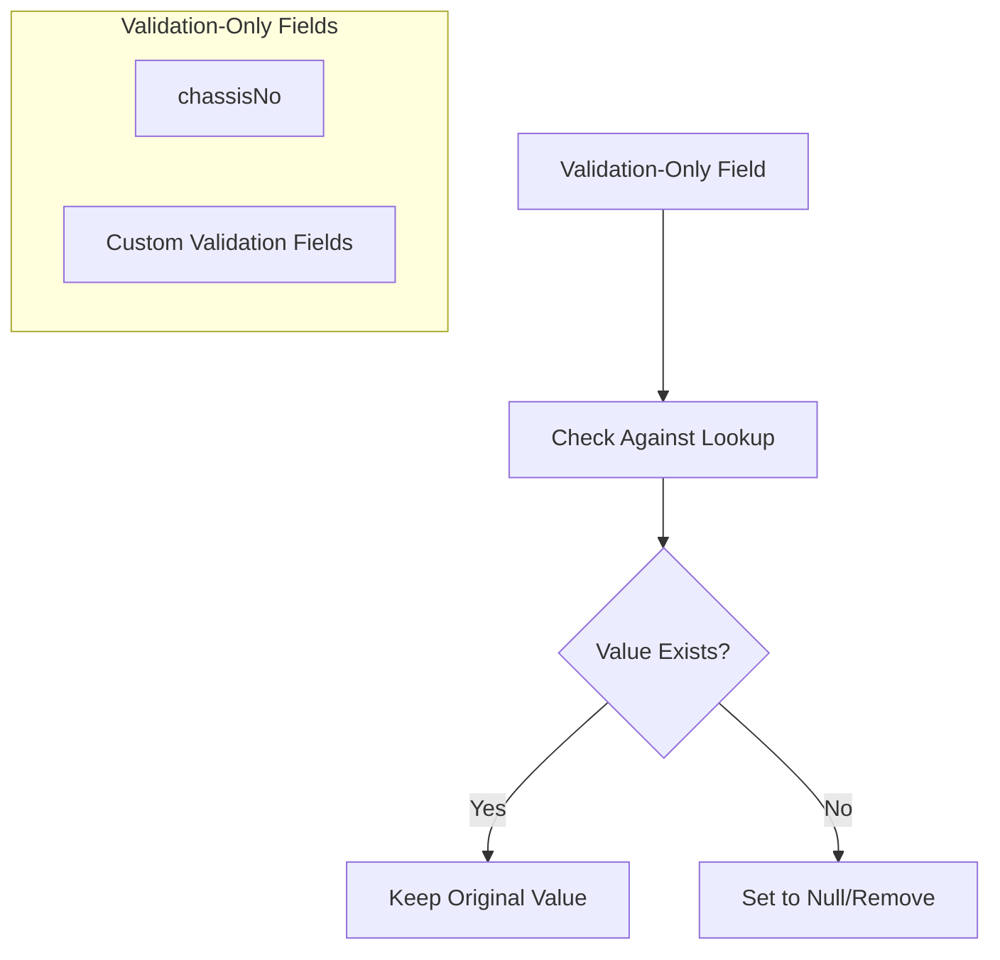

Example: `chassisNo` field is validated to ensure the chassis exists but the original chassis number is kept in the payload.

## Lookup Data Caching

### Redis-Based Caching

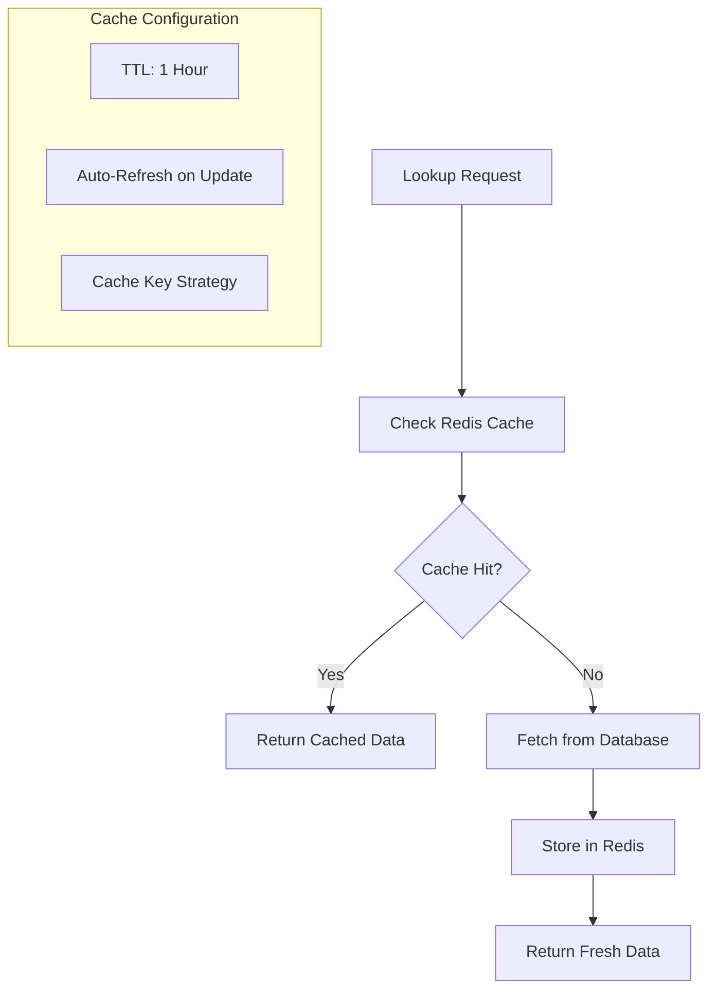

### Cache Refresh Strategy

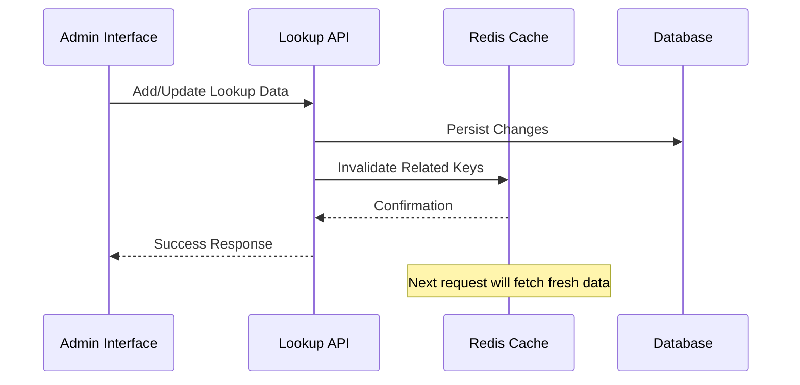

## Error Handling

### Lookup Resolution Errors

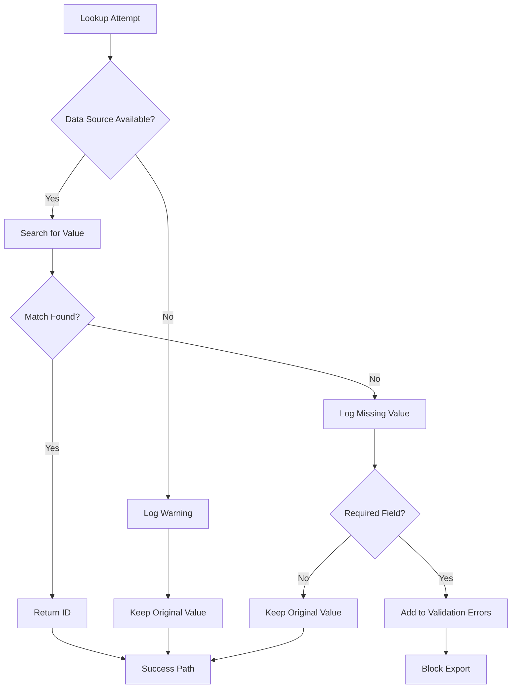

### Fallback Strategies

1. **Keep Original Value**: For optional fields or when lookup data is unavailable
2. **Use Empty/Null**: For non-critical fields that can be empty
3. **Block Export**: For required fields that must have valid lookups
4. **User Correction**: Highlight invalid values for user review

## Performance Optimization

### Batch Lookup Processing

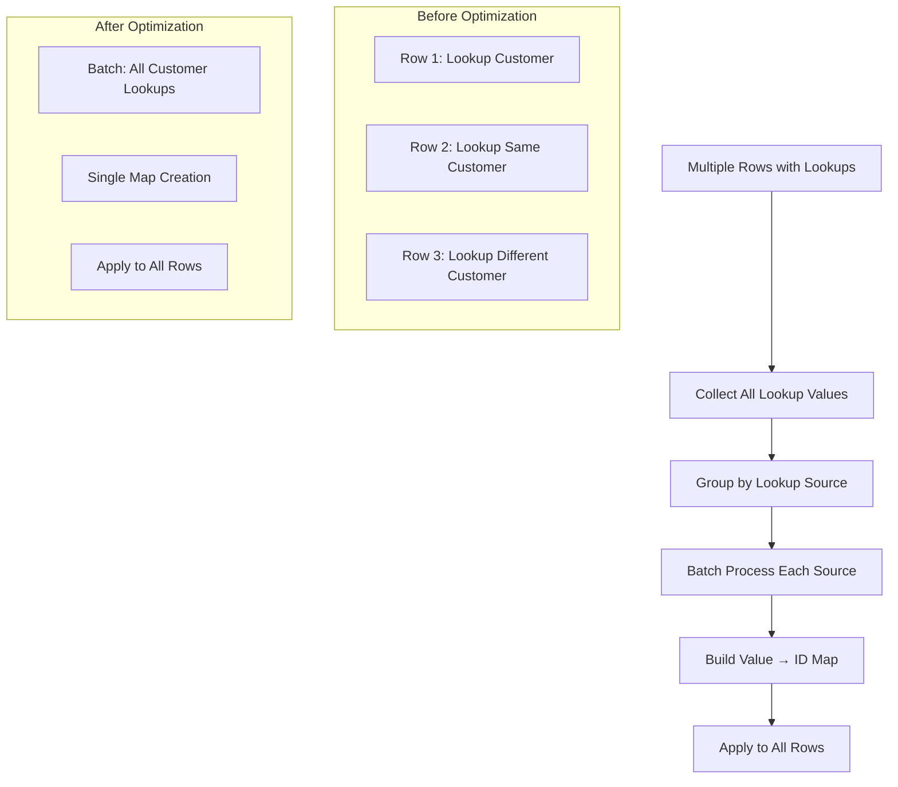

### Lookup Data Preloading

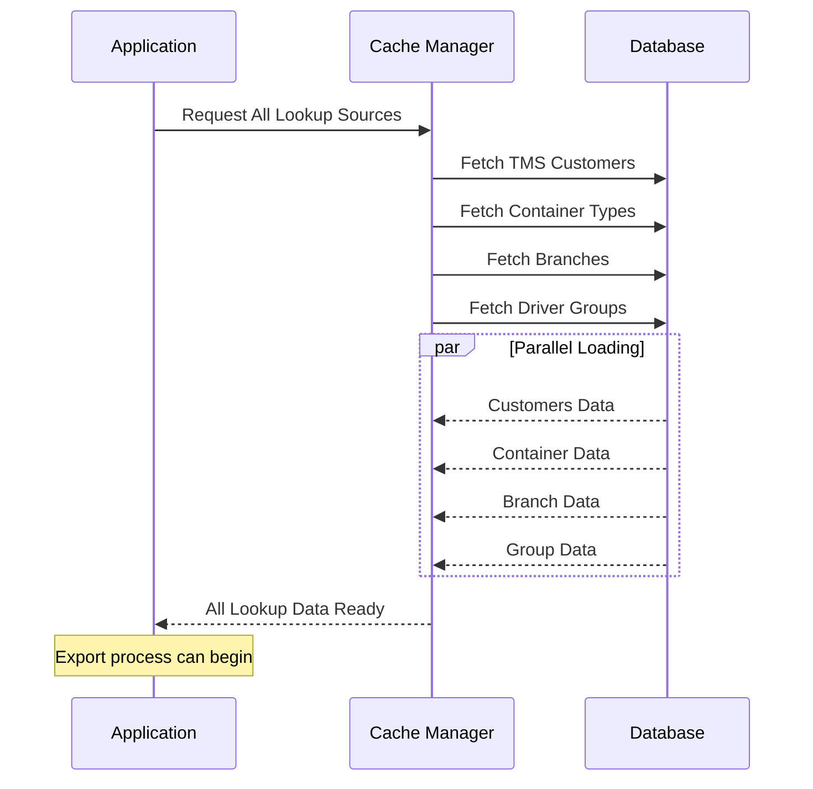

## Lookup System Configuration

### Adding New Lookup Sources

To add a new lookup source:

1. **Add to Lookup Key Mapper**:
```typescript
const LookupKeyMapper = {
  'newLookupType': 'internalSourceName'
};
```

2. **Configure in Entity Fields**:
```json
{
  "lookupValidation": {
    "lookupId": "newLookupType",
    "lookupField": "fieldToMatch"
  }
}
```

3. **Implement Data Source**:
```typescript
const newLookupSource = {
  getData: () => fetchFromAPI(),
  field: 'name',
  name: 'Display Name'
};
```

### Lookup Field Matching Strategy

The system tries multiple field matching strategies:

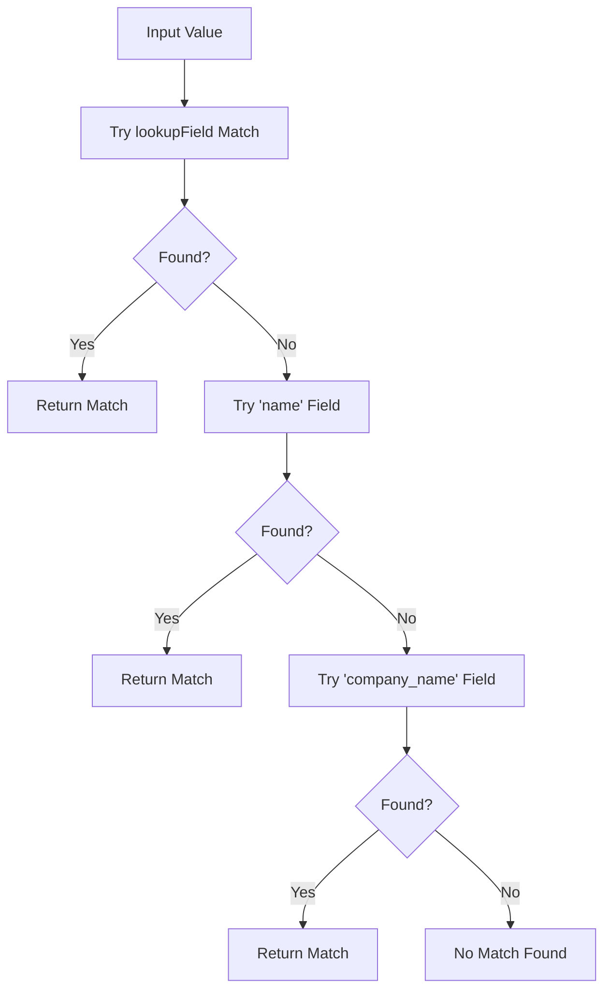

This flexible matching ensures compatibility with various data source structures.

## Related Files

- `src/hooks/useExport.ts` - Main lookup processing logic
- `src/utils/fieldMapper.ts` - Lookup field transformation
- `src/lib/constants/index.ts` - Lookup key mappings
- `src/contexts/AppContext.tsx` - Lookup data management
- `exportEntities.json` - Lookup configuration